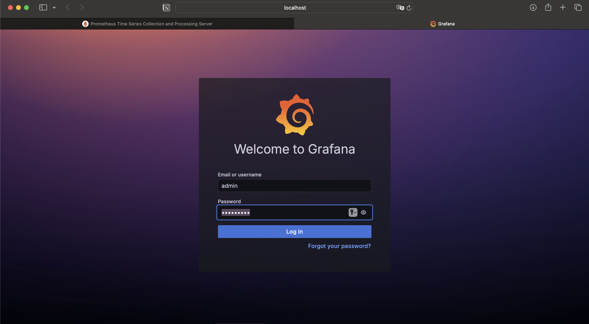

# Coleta de métricas com Prometheus e Grafana
# 1. Tecnologias e ferramentas utilizadas
- .NET
- dotnet counters
- Prometheus
- Grafana
- Docker
- JetBrains Rider (IDE)

#  2. Conceitos aprendidos
- Importância da coleta de métricas
- Instrumentação e coleta de métricas
- Monitoramento de aplicações 
- Injeção de dependência
# 3. Etapas da implementação
## 3.1 Criação do aplicativo ASP.NET Core

### Adicionar packages do OpenTelemetry

### Configurar Program.cs
            using OpenTelemetry.Metrics;

            var builder = WebApplication.CreateBuilder(args);
            builder.Services.AddOpenTelemetry()
                .WithMetrics(builder =>
                {
                    builder.AddPrometheusExporter();

                    builder.AddMeter("Microsoft.AspNetCore.Hosting",
                                    "Microsoft.AspNetCore.Server.Kestrel");
                    builder.AddView("http.server.request.duration",
                        new ExplicitBucketHistogramConfiguration
                        {
                            Boundaries = new double[] { 0, 0.005, 0.01, 0.025, 0.05,
                                0.075, 0.1, 0.25, 0.5, 0.75, 1, 2.5, 5, 7.5, 10 }
                        });
                });
            var app = builder.Build();

            app.MapPrometheusScrapingEndpoint();

            app.MapGet("/", () => "Hello OpenTelemetry! ticks:"
                                + DateTime.Now.Ticks.ToString()[^3..]);

            app.Run();
##  3.2 Exibir métricas
### Instalar dotnet-counters
### Rodar aplicação

### Monitoramento atraves do dotnet-counters
        dotnet-counters monitor -n BlazorApp1 --counters Microsoft.AspNetCore.Hosting

## 3.2 Enriquecer a métrica de solicitação
### Substituir código do Program.cs por um que utiliza o `Microsoft.AspNetCore.Http.Features`
- Essa atualização adiciona uma marca personalizada contendo a origem de marketing da solicitação para a métrica http.server.request.duration. A marca permite que as solicitações sejam categorizadas por tipo de meio de marketing, o que pode ser útil ao analisar o tráfego de aplicativos Web.
        
        using Microsoft.AspNetCore.Http.Features;

        var builder = WebApplication.CreateBuilder();
        var app = builder.Build();

        app.Use(async (context, next) =>
        {
            var tagsFeature = context.Features.Get<IHttpMetricsTagsFeature>();
            if (tagsFeature != null)
            {
                var source = context.Request.Query["utm_medium"].ToString() switch
                {
                    "" => "none",
                    "social" => "social",
                    "email" => "email",
                    "organic" => "organic",
                    _ => "other"
                };
                tagsFeature.Tags.Add(new KeyValuePair<string, object?>("mkt_medium", source));
            }

            await next.Invoke();
        });

        app.MapGet("/", () => "Hello World!");

        app.Run();

### Rodar aplicação e coletar métrica pelo dot-net counters

## 3.3 Criar métricas personalizadas com IMeterFactory
### Criar nova classe "ContosoMetrics"
- É a partir dessa classeque iremos coletar nossa métrica personalisada.
- Registrar a classe com Dependency Injection(DI) no Program.cs
### Adaptar código do Program.cs para nova coleta
        using WebMetric;
        using WebMetric.Models;

        var builder = WebApplication.CreateBuilder(args);

        builder.Services.AddSingleton<ContosoMetrics>();

        var app = builder.Build();

        app.MapPost("/complete-sale", (SaleModel model, ContosoMetrics metrics) =>
        {
            metrics.ProductSold(model.ProductName, model.QuantitySold);
        });

        app.Run();

### Realizar testes pelo Postman
- para gerar dados para serem coletados pela métrica definida, vamos realizar requisições pelo Postman:

### Exibir métricas com dotnet-counters
- Com o mesmo comando de monitoramento utilizado anteirormente, vamos exibir a coleta da metrica personalizada no terminal:

## 3.5 Envio das métricas para o Prometheus e Grafana
Vamos retomar para o código inicial do Program.cs [dessa etapa](#configurar-programcs)!
### Acessar métrica pelo /metrics

### Criação do docker-compose.yml e yml do prometheus
- Como alterantiva ao tutorial, foi optado pela utilização do docker para o Prometheus e Grafana.

### Acessar prometheus e visualizar métrica

### Configurar dashboard no Grafana
É possivel gerar um novo dashboard, com a metrica personalizada:

### Também é possivel importar um template do ASPNET, para visualizar as métricas coletadas

